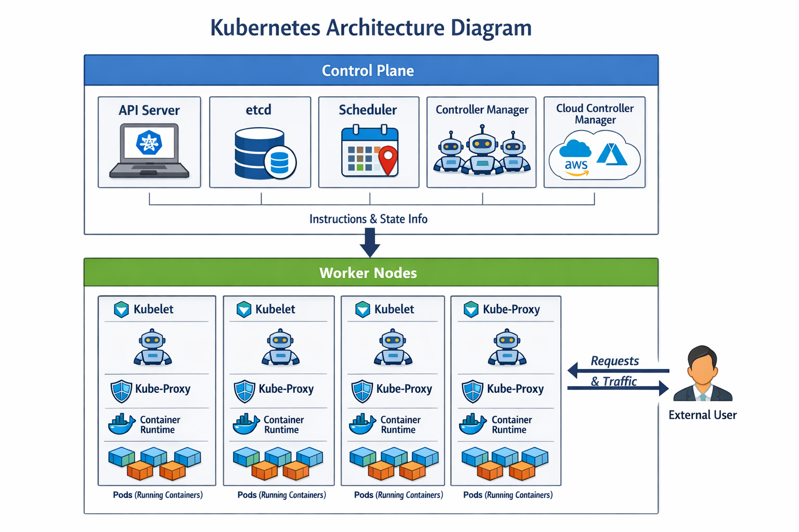

# Kubernetes Architecture & Concepts Explained (Startup Example)

Ye document aapko **Kubernetes ke architecture** aur **microservices concept** ko samajhne mein help karega, simple words aur diagrams ke saath.

---

## 1. What is Kubernetes?

**Kubernetes (K8s)** ek container orchestration tool hai jo Docker ya kisi bhi containerized application ko manage karta hai.

- Automatically scale karta hai (up/down)
- Agar container crash ho jaye → auto-heal karta hai
- Cluster-wide applications ka **desired state maintain** karta hai
- Microservices efficiently manage karta hai

### Why Kubernetes?

2014 mein Google ko apne applications scale karne mein problem ho rahi thi. Unke systems baar-baar crash ho rahe the.  
Solution: Google ne **Borg system** develop kiya → robust, self-healing orchestration system.  
Kubernetes is **open-source version** of Borg, designed to handle **microservices** efficiently.

---

## 2. Monolithic vs Microservices

### Monolithic Application
- Ek bara software jisme saari services ek hi repository mein hoti hain
- Example: Quick Mart (clothes shop, grocery shop, shoes shop sab ek hi system mein)
- Problem:
  - Agar ek service crash kare → poori application crash
  - Update karna mushkil, manage karna difficult

### Microservices Architecture
- Bara application chote-chote **independent services** mein divide hota hai
- Har service alag container mein chalti hai
- Example:
  - Agar vegetable service crash ho jaye → baaki shops/services unaffected
- Advantage:
  - Easy management
  - Easy scaling
  - Easy updates

---

## 3. Kubernetes as an Orchestrator

Docker containers chal rahe hain lekin **scale aur heal automatically nahi hota**.  
Kubernetes ek **orchestrator** hai jo containers ko manage karta hai:

- Decide karta hai **konsa container kahan run hoga** (Scheduler)
- Automatically **heal karta hai** agar container crash ho jaye (Controller Manager)
- Scale up/down kar sakta hai based on demand
- Maintains **desired state** of your cluster via API Server

---

## 4. Kubernetes Architecture Diagram

---

## 5. Control Plane (Master Node Components)

### API Server
- Cluster ka **front desk**
- User commands (kubectl) yahan se jaate hain
- Requests validate karta hai aur cluster components ko forward karta hai

### etcd
- Cluster ka **database**
- Stores all cluster info: Nodes, Pods, Services, Configuration, State

### Scheduler
- Decide karta hai **konsa Pod kis Node par run hoga**
- Resource availability aur constraints ko consider karta hai

### Controller Manager
- Continuous monitoring
- Ensure karta hai ki **desired state** aur **actual state** match kare
- Pod crash → automatically recreate karta hai

### Cloud Controller Manager
- Integrates with cloud (AWS, Azure, GCP)
- Manages load balancers & persistent volumes

---

## 6. Worker Node Components

### kubelet
- Node ka **manager**
- Ensures containers **expected state** mein run ho rahe hain

### kube-proxy
- **Network traffic manager**
- Routes requests: Pod ↔ Pod aur external client ↔ Pod

### Container Runtime
- Software that runs containers (Docker, containerd, etc.)

---

## 7. Core Kubernetes Objects

### Pod
- Smallest deployable unit
- 1 ya multiple containers run together

### Service
- Stable network endpoint for Pods
- Reliable communication between services

### Volume
- Persistent storage attached to Pods

### Namespace
- Resource isolation for multiple teams

### Ingress
- HTTP/HTTPS routing
- Acts as **front door** to cluster services

---

## 8. Hands-on Command Flow (kubectl)

1. User → API Server: `kubectl apply -f pod.yaml`
2. API Server → Scheduler: Decide node for Pod
3. API Server → Controller Manager: Monitor & maintain desired state
4. Controller Manager → Kubelet: Start Pod on selected node
5. Kubelet → Container Runtime: Run container
6. Kube-proxy: Network routing between Pods & external traffic
7. User Access: Requests routed to appropriate service via kube-proxy

---

## 9. Startup Example

**Without Kubernetes:**
- Single Docker container → crash or scaling issues
- Startup cannot handle heavy traffic, auto-healing not possible

**With Kubernetes:**
- Multi-node cluster (like MNC architecture)
- Pods automatically **heal & scale**
- Orchestrator ensures all services run smoothly
- Cluster-level management → not just a single server

---

## 10. Analogy with Examples

- **Containers = Ships**  
  - Docker logo looks like a ship carrying containers (boxes).  
  - Each container represents an app or microservice.

- **Kubernetes = Steering Wheel / Captain**  
  - Kubernetes logo resembles a steering wheel.  
  - Just like a captain steers ships, Kubernetes decides where containers run, heals crashed containers, and manages scaling.

- **Cluster = Fleet of Ships**  
  - Multiple containers and nodes form a fleet (cluster).  
  - If one ship/container fails, the fleet continues operating, ensuring high availability.

---

## 11. Summary: Why Use Kubernetes?

- Efficient management of **microservices**
- Automatic **scaling & healing**
- Cluster-level orchestration
- Highly **robust system**, inspired by Google Borg (2014)

Kubernetes ensures your applications are **resilient, scalable, and reliable**, from startup level to enterprise scale.
